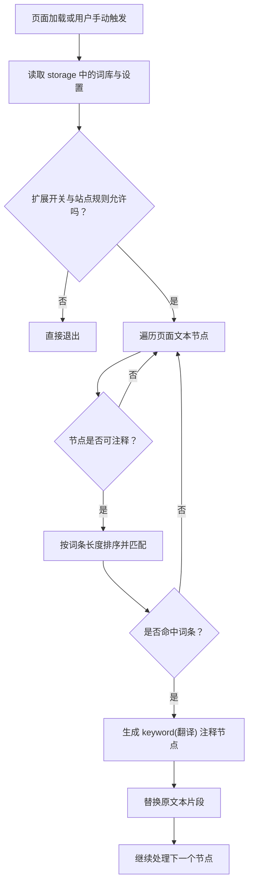

# keyword-translator 架构说明

本文档定义 `keyword-translator` 的目标、模块边界、核心数据模型和注释引擎流程，用来约束后续迭代时的实现方向。

## 目标定位

`keyword-translator` 面向的是“阅读增强”场景，而不是通用全文翻译。

核心能力是：

- 维护一份可编辑关键词词库
- 在网页文本中命中关键词
- 保留原文，并以内联方式追加 `keyword(翻译)`
- 降低开发者在原文和翻译工具之间的切换成本

## 模块分层

### 页面层

负责用户可见界面和交互行为。

- `popup`
  - 快速查看扩展开关、词库数量、当前站点状态
  - 触发“立即注释当前页面”
- `options`
  - 管理词库、扩展设置和后续导入导出能力
- `content`
  - 扫描当前网页文本节点
  - 执行注释渲染

### 领域层

负责核心业务规则，不直接依赖具体页面。

- `matcher`
  - 词条排序与匹配策略
  - 长词优先、启用状态过滤
- `site`
  - 域名允许/阻止规则
- `storage`
  - 词库、设置、域名规则的读写

### 基础设施层

负责浏览器 API 和运行环境连接。

- `background`
  - 统一消息入口
  - 连接 popup 与 content script
- `chrome.storage`
  - 负责本地持久化

## 核心数据模型

```ts
type GlossaryEntry = {
  id: string;
  source: string;
  translation: string;
  enabled: boolean;
  caseSensitive: boolean;
  createdAt: number;
  updatedAt: number;
};

type DomainRule = {
  id: string;
  pattern: string;
  mode: "allow" | "block";
  enabled: boolean;
};

type ExtensionSettings = {
  extensionEnabled: boolean;
  annotateOnLoad: boolean;
  annotationMode: "inline-brackets";
  excludedTags: string[];
};
```

## 页面流转

### 内容页优先

1. 用户打开任意网页
2. content script 读取词库和设置
3. 如果扩展开启且站点允许，开始扫描文本节点
4. 命中词条后渲染为 `keyword(翻译)`

### 弹窗辅助

1. 用户打开 popup
2. popup 读取当前站点和词库数量
3. 用户可以手动触发当前页面重新注释
4. 用户可以跳转到 options 继续维护词库

### 设置页兜底

1. 用户进入 options
2. 新增、删除或调整词条
3. 保存后写入浏览器存储
4. 后续页面注释读取同一份状态

## 注释引擎流程

当前版本的注释引擎遵循“先稳定，再复杂”的原则。

1. 读取词库与设置
2. 对词条做启用过滤和长度排序
3. 遍历页面文本节点
4. 跳过 `code`、`pre`、`script`、`style`、`textarea`、`input`
5. 对文本执行最长匹配优先切分
6. 将命中片段替换为带标记的注释节点
7. 避免重复注释已经处理过的区域

## Mermaid 流程图



## 当前边界

第一阶段不做这些能力：

- AI 自动释义生成
- 云端同步词库
- 复杂词形还原
- Shadow DOM 和 iframe 全覆盖
- 团队级共享词库发布流程

这些能力会留到后续里程碑里逐步扩展。

