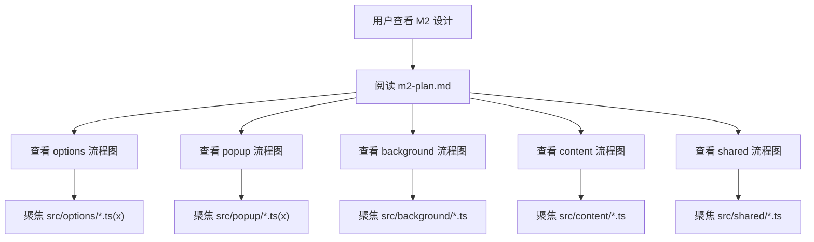

# M2 Milestone Plan

## Scope

M2 focuses on a minimal but real user-value loop:

1. glossary management
2. robust annotation execution
3. dark/light mode support
4. local import/export of glossary data

Each module is shipped in small units. After each unit, tests must run and results are reported for CR.

## Role Updates

### UX Designer

- Profile:
  - senior visual and aesthetic capability
  - fluent in multiple design patterns
  - avoids template-like UI
- Allowed resources:
  - Material Design
  - Ant Design
  - Tailwind utility ideas
- Style keywords:
  - natural minimalism
  - modern
  - restrained
  - harmonious
- Hard constraints:
  - no Tailwind default purple palette
  - no gradient background
  - must support dark/light mode switch

### Project Manager Notice

New feature request is accepted into M2: local glossary import/export.

## Import/Export Strategy Decision

Based on architecture and frontend feasibility, M2 adopts option `1` first:

- export as downloadable file
- export as clipboard JSON text
- import from local file
- import from pasted JSON text

Reason:

- lowest implementation risk
- easy to test
- transparent format for users and teams

Option `2` (compressed key encode/decode) is moved to M3+ as an enhancement.

## New Requirement Evaluation (2026-04-27)

User request summary:

- default several professional glossary sets for different industries
- allow the LLM to translate with selected professional glossary context, then optionally replace page text
- optionally translate selected text immediately through a shortcut
- UI for maintaining separate professional glossary lists, including export, delete, and local persistence
- AI calibration
- AI API management and provider/model switching
- glossary import

Assessment:

- Professional glossary lists are reasonable and should become the next core data-model step. The current project has one flat `glossary` array, so the next milestone should introduce `GlossaryCollection` before adding AI features.
- Default industry vocabularies are reasonable if they are small, transparent presets that users choose to import. They should not be auto-injected into every user's active glossary because that can create noise and storage bloat.
- Import/export remains reasonable and is already part of M2. After glossary collections exist, import/export should support both one collection and all collections.
- AI API management is reasonable, but it must be built before AI translation. Users need provider, model, base URL, API key, and enable/disable controls. API keys must stay local.
- AI calibration is reasonable, but the term is broad. In this project it should mean a test panel that sends sample text + active glossary to the selected model and lets the user compare, save prompt settings, and tune terminology behavior.
- LLM glossary-aware translation is feasible, but it is a product expansion beyond keyword annotation. It needs permissions, privacy messaging, request chunking, error recovery, rate-limit handling, and an undo/restore path before replacing page text.
- Selected-text shortcut translation is feasible after the AI stack exists. It should start as a command that shows a small translation result near the selection or in the popup, then later support replace-selection where the page allows editable replacement.

Adjusted product principle:

- Keep `keyword-translator` centered on controlled reading assistance.
- Treat AI page replacement as an explicit action with preview/undo, not as automatic page mutation.
- Make glossary collections the bridge between the current annotation product and later AI translation.

## Replanned Roadmap

### M2 Current Completion Line

M2 remains focused on the current shipped foundation:

- theme foundation
- single-glossary import/export
- annotation stability
- popup/background action consistency

No new AI work is added to M2, because M2 should close the stable local glossary loop first.

### M3 Glossary Collections and Industry Presets

- Goal:
  - replace the single flat glossary with multiple named glossary collections
  - support active collection selection for annotation
  - provide several small built-in industry presets that users can import on demand
- Included features:
  - create, rename, delete, duplicate glossary collections
  - maintain entries independently per collection
  - switch active collection from options, with popup read-only status
  - import/export one collection
  - import/export all collections
  - local persistence through browser storage
- Suggested default presets:
  - software engineering
  - finance
  - medicine
  - legal
  - manufacturing
  - academic reading
- Key code areas:
  - `src/shared/types.ts`
  - `src/shared/storage.ts`
  - `src/shared/glossary-transfer.ts`
  - `src/options/App.tsx`
  - `src/popup/App.tsx`
  - `src/content/index.ts`
- Tests:
  - migration from flat `glossary` to `glossaryCollections`
  - active collection selection
  - per-collection import/export
  - preset import without overwriting user data
  - annotation uses only the active collection

### M4 AI API Management

- Goal:
  - let users configure and switch AI providers locally
  - establish the secure request path used by later AI features
- Included features:
  - provider list with custom OpenAI-compatible endpoint support
  - API key storage in local browser storage
  - model name management
  - active provider/model switch
  - connection test with clear success/failure messages
  - global AI enable/disable switch
- Key code areas:
  - `src/shared/types.ts`
  - `src/shared/storage.ts`
  - `src/background/index.ts`
  - `src/options/App.tsx`
- Tests:
  - provider config validation
  - API key is not exported with glossary data
  - active provider switching
  - background request contract
  - connection-test error handling

### M5 AI Calibration and Glossary-Aware Translation

- Goal:
  - use active glossary collections as terminology constraints for LLM translation
  - provide a calibration surface before touching page text
- Included features:
  - calibration panel with sample source text
  - prompt template settings for terminology priority
  - glossary context preview before sending
  - translation result comparison
  - save calibration profile per provider or globally
  - manual translate selected text from popup/options test panel
- Key code areas:
  - `src/shared/types.ts`
  - `src/shared/storage.ts`
  - `src/background/index.ts`
  - `src/options/App.tsx`
- Tests:
  - prompt payload includes active glossary terms
  - disabled entries are excluded
  - calibration profile persists
  - failed AI request does not mutate local glossary

### M6 Selection Shortcut and Controlled Page Replacement

- Goal:
  - make AI translation available in the reading flow without unsafe automatic page rewrites
- Included features:
  - browser command shortcut for selected-text translation
  - selected text detection in content script
  - result popover or popup handoff
  - optional replace-selection for editable fields
  - optional replace-page-text mode with preview and restore
  - request chunking for longer page text
- Key code areas:
  - `public/manifest.json`
  - `src/content/index.ts`
  - `src/background/index.ts`
  - `src/popup/App.tsx`
  - `src/shared/dom.ts`
- Tests:
  - shortcut message routing
  - selection extraction
  - translation result rendering
  - replacement undo/restore
  - forbidden-node and editable-field behavior

### M7 Polish, Safety, and Release Readiness

- Goal:
  - harden the product after AI features are added
- Included features:
  - privacy copy for AI requests
  - rate-limit and timeout handling
  - local request history opt-in
  - E2E coverage for glossary collection + AI settings flows
  - documentation and release checklist

## Minimal Module Breakdown

## M2-01 UX Theme Foundation

- Goal:
  - introduce dark/light theme switch in options and popup
  - apply neutral palette and non-gradient backgrounds
- Key code areas:
  - `src/options/styles.css`
  - `src/popup/styles.css`
  - theme state in storage + UI binding
- Tests:
  - unit test count target: `2`
  - checks:
    - theme state read/write
    - UI class reflects selected mode

## M2-02 Import/Export Basic I/O

- Goal:
  - export glossary JSON to file
  - copy glossary JSON to clipboard
  - import glossary from local JSON file
  - import glossary from pasted JSON
- Key code areas:
  - `src/options/App.tsx`
  - `src/shared/storage.ts`
  - `src/shared/types.ts`
- Tests:
  - unit test count target: `4`
  - checks:
    - valid import updates glossary
    - invalid JSON rejected
    - export format structure
    - clipboard payload correctness

## M2-03 Annotation Stability Upgrade

- Goal:
  - reduce duplicate annotation
  - improve forbidden-node skip logic
  - keep long-term performance stable for doc pages
- Key code areas:
  - `src/content/index.ts`
  - `src/shared/dom.ts`
  - `src/shared/matcher.ts`
- Tests:
  - unit test count target: `3`
  - checks:
    - longest-match behavior
    - forbidden node skip
    - duplicate annotation guard

## M2-04 Popup/Background Action Consistency

- Goal:
  - keep popup actions and background routing consistent
  - ensure annotation trigger works in active tab
- Key code areas:
  - `src/popup/App.tsx`
  - `src/background/index.ts`
- Tests:
  - unit test count target: `2`
  - checks:
    - message payload contract
    - toggle state sync behavior

## M2 Test Metric Target

- planned new unit tests: `11`
- planned E2E tests promoted from skipped: `1` minimum

Final M2 milestone report must include:

- total test case count
- newly added test count
- pass count
- fail count
- skipped count

## Diagram Rules

Mermaid diagrams for this project now follow these rules:

- each key source folder gets its own focused diagram
- each diagram only describes `.ts` / `.tsx` logic inside that folder
- cross-folder interactions may appear only as simple input/output nodes
- function labels use the format `说明(functionName)`
- user actions use explicit labels such as `用户输入` and `用户点击`
- all diagrams must pass Mermaid syntax validation after editing
- folder-level diagrams should live beside the code they describe

## Folder Diagrams

- M2 index: [m2-core.mmd](C:/Users/林/Desktop/programming/Kw-Translator/docs/plans/m2-core.mmd)
- options: [flow.mmd](C:/Users/林/Desktop/programming/Kw-Translator/src/options/flow.mmd)
- popup: [flow.mmd](C:/Users/林/Desktop/programming/Kw-Translator/src/popup/flow.mmd)
- background: [flow.mmd](C:/Users/林/Desktop/programming/Kw-Translator/src/background/flow.mmd)
- content: [flow.mmd](C:/Users/林/Desktop/programming/Kw-Translator/src/content/flow.mmd)
- shared: [flow.mmd](C:/Users/林/Desktop/programming/Kw-Translator/src/shared/flow.mmd)

## Data Flow Diagram (M2 Index)

## CR Loop Rule

For every minimal module:

1. implement
2. run related tests
3. report code + test result for CR

Project manager summary is required only when the whole milestone is completed.
