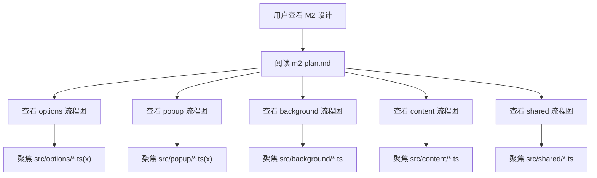

# M2 Milestone Plan

## Scope

M2 focuses on a minimal but real user-value loop:

1. glossary management
2. robust annotation execution
3. dark/light mode support
4. local import/export of glossary data

Each module is shipped in small units. After each unit, tests must run and results are reported for CR.

## Role Updates

### UX Designer

- Profile:
  - senior visual and aesthetic capability
  - fluent in multiple design patterns
  - avoids template-like UI
- Allowed resources:
  - Material Design
  - Ant Design
  - Tailwind utility ideas
- Style keywords:
  - natural minimalism
  - modern
  - restrained
  - harmonious
- Hard constraints:
  - no Tailwind default purple palette
  - no gradient background
  - must support dark/light mode switch

### Project Manager Notice

New feature request is accepted into M2: local glossary import/export.

## Import/Export Strategy Decision

Based on architecture and frontend feasibility, M2 adopts option `1` first:

- export as downloadable file
- export as clipboard JSON text
- import from local file
- import from pasted JSON text

Reason:

- lowest implementation risk
- easy to test
- transparent format for users and teams

Option `2` (compressed key encode/decode) is moved to M3+ as an enhancement.

## Minimal Module Breakdown

## M2-01 UX Theme Foundation

- Goal:
  - introduce dark/light theme switch in options and popup
  - apply neutral palette and non-gradient backgrounds
- Key code areas:
  - `src/options/styles.css`
  - `src/popup/styles.css`
  - theme state in storage + UI binding
- Tests:
  - unit test count target: `2`
  - checks:
    - theme state read/write
    - UI class reflects selected mode

## M2-02 Import/Export Basic I/O

- Goal:
  - export glossary JSON to file
  - copy glossary JSON to clipboard
  - import glossary from local JSON file
  - import glossary from pasted JSON
- Key code areas:
  - `src/options/App.tsx`
  - `src/shared/storage.ts`
  - `src/shared/types.ts`
- Tests:
  - unit test count target: `4`
  - checks:
    - valid import updates glossary
    - invalid JSON rejected
    - export format structure
    - clipboard payload correctness

## M2-03 Annotation Stability Upgrade

- Goal:
  - reduce duplicate annotation
  - improve forbidden-node skip logic
  - keep long-term performance stable for doc pages
- Key code areas:
  - `src/content/index.ts`
  - `src/shared/dom.ts`
  - `src/shared/matcher.ts`
- Tests:
  - unit test count target: `3`
  - checks:
    - longest-match behavior
    - forbidden node skip
    - duplicate annotation guard

## M2-04 Popup/Background Action Consistency

- Goal:
  - keep popup actions and background routing consistent
  - ensure annotation trigger works in active tab
- Key code areas:
  - `src/popup/App.tsx`
  - `src/background/index.ts`
- Tests:
  - unit test count target: `2`
  - checks:
    - message payload contract
    - toggle state sync behavior

## M2 Test Metric Target

- planned new unit tests: `11`
- planned E2E tests promoted from skipped: `1` minimum

Final M2 milestone report must include:

- total test case count
- newly added test count
- pass count
- fail count
- skipped count

## Diagram Rules

Mermaid diagrams for this project now follow these rules:

- each key source folder gets its own focused diagram
- each diagram only describes `.ts` / `.tsx` logic inside that folder
- cross-folder interactions may appear only as simple input/output nodes
- function labels use the format `说明(functionName)`
- user actions use explicit labels such as `用户输入` and `用户点击`
- all diagrams must pass Mermaid syntax validation after editing
- folder-level diagrams should live beside the code they describe

## Folder Diagrams

- M2 index: [m2-core.mmd](C:/Users/林/Desktop/programming/Kw-Translator/docs/plans/m2-core.mmd)
- options: [flow.mmd](C:/Users/林/Desktop/programming/Kw-Translator/src/options/flow.mmd)
- popup: [flow.mmd](C:/Users/林/Desktop/programming/Kw-Translator/src/popup/flow.mmd)
- background: [flow.mmd](C:/Users/林/Desktop/programming/Kw-Translator/src/background/flow.mmd)
- content: [flow.mmd](C:/Users/林/Desktop/programming/Kw-Translator/src/content/flow.mmd)
- shared: [flow.mmd](C:/Users/林/Desktop/programming/Kw-Translator/src/shared/flow.mmd)

## Data Flow Diagram (M2 Index)

## CR Loop Rule

For every minimal module:

1. implement
2. run related tests
3. report code + test result for CR

Project manager summary is required only when the whole milestone is completed.
